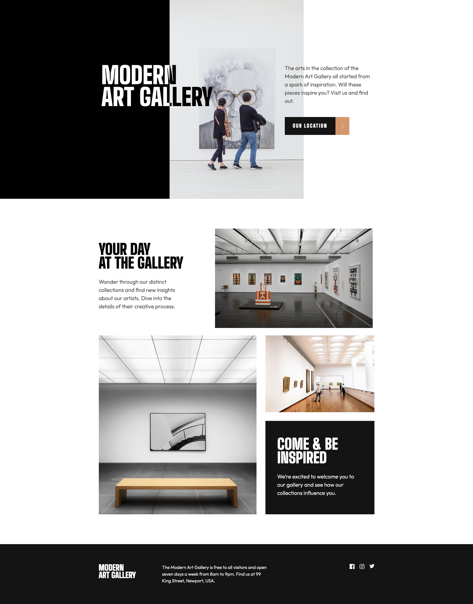

# Frontend Mentor - Art gallery website solution

This is a solution to the [Art gallery website challenge on Frontend Mentor](https://www.frontendmentor.io/challenges/art-gallery-website-yVdrZlxyA). Frontend Mentor challenges help you improve your coding skills by building realistic projects.

## Table of contents

- [Overview](#overview)
  - [The challenge](#the-challenge)
  - [Screenshot](#screenshot)
  - [Links](#links)
- [My process](#my-process)
  - [Built with](#built-with)
  - [What I learned](#what-i-learned)
  - [Continued development](#continued-development)
  - [Useful resources](#useful-resources)
- [Author](#author)
- [Acknowledgments](#acknowledgments)

## Overview

### The challenge

ユーザーができること:

- デバイスの画面サイズに応じて、各ページの最適なレイアウトを表示します
- サイト全体のすべてのインタラクティブ要素のホバー状態を確認できる

### Screenshot

### Links

- Solution URL: [リンク](https://your-solution-url.com)
- Live Site URL: [リンク](https://your-live-site-url.com)

## My process

### Built with

- Flexbox
- CSS Grid
- Mobile-first workflow
